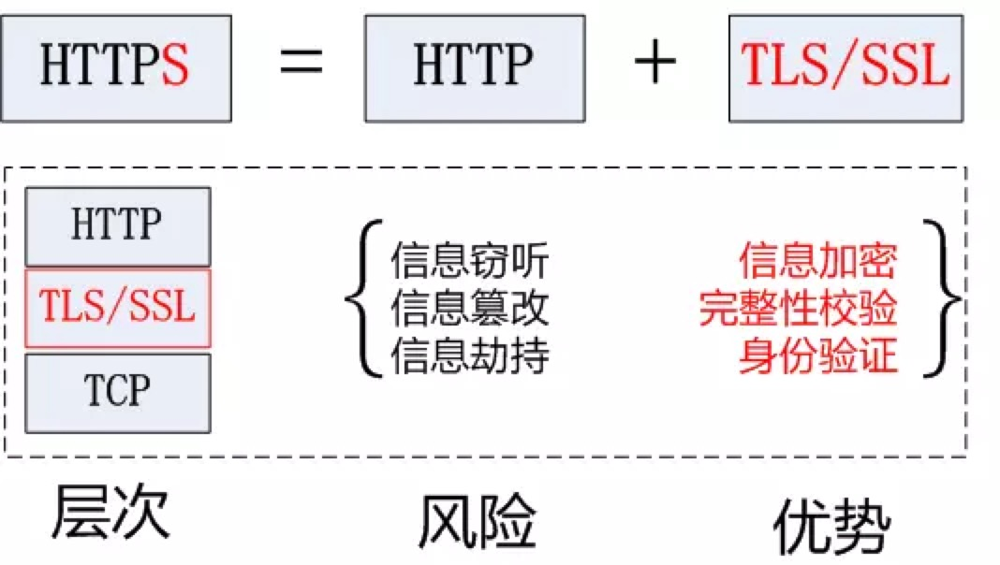

## http/https
http缺点
通信使用明文，可能被窃听
不验证通信方的身份，可能遭遇伪装
无法证明报文的完整性，有可能遭遇篡改

https = http + TLS/SSL(具有身份验证，信息加密和完整性校验的功能)
HTTPS开发的主要目的，是提供对网站服务器的身份认证，保护交换数据的隐私与完整性,加密数据包。
https://juejin.im/post/5af557a3f265da0b9265a498

http工作过程
（1）地址解析
协议名 + 主机名 + 端口 + 对象路径等 （需要域名系统DNS解析域名www.baidu.com，得到主机IP地址）
（2）封装http请求数据包
把以上部分信息结合本机自己的信息，封装成一个http请求数据包
（3）封装成TCP包，建立TCP连接（TCP的三次握手）
在HTTP工作开始之前，客户机（Web浏览器）首先要通过网络与服务器建立连接，该连接是通过TCP来完成的，该协议与IP协议共同构建Internet，即著名的TCP/IP协议族，因此Internet又被称作是TCP/IP网络。HTTP是比TCP更高层次的应用层协议，根据规则，只有低层协议建立之后才能，才能进行更层协议的连接，因此，首先要建立TCP连接，一般TCP连接的端口号是80。这里是8080端口。
（4）客户机发送请求命令
建立连接后，客户机发送一个请求给服务器，请求方式的格式为：统一资源标识符（URL）、协议版本号，后边是MIME信息包括请求修饰符、客户机信息和可内容。
（）5服务器响应
服务器接到请求后，给予相应的响应信息，其格式为一个状态行，包括信息的协议版本号、一个成功或错误的代码，后边是MIME信息包括服务器信息、实体信息和可能的内容。
实体消息是服务器向浏览器发送头信息后，它会发送一个空白行来表示头信息的发送到此为结束，接着，它就以Content-Type应答头信息所描述的格式发送用户所请求的实际数据
（6）服务器关闭TCP连接
一般情况下，一旦Web服务器向浏览器发送了请求数据，它就要关闭TCP连接，然后如果浏览器或者服务器在其头信息加入了这行代码
Connection:keep-alive
TCP连接在发送后将仍然保持打开状态，于是，浏览器可以继续通过相同的连接发送请求。保持连接节省了为每个请求建立新连接所需的时间，还节约了网络带宽。

https = http + TLS/SSL
TLS/SSL全称安全传输层协议Transport Layer Security, 是介于TCP和HTTP之间的一层安全协议，不影响原有的TCP协议和HTTP协议，所以使用HTTPS基本上不需要对HTTP页面进行太多的改造。

HTTPS是在HTTP上建立SSL加密层，并对传输数据进行加密，是HTTP协议的安全版。HTTPS主要作用是：

对数据进行加密，并建立一个信息安全通道，来保证传输过程中的数据安全
对网站服务器进行真实身份认证

HTTPS协议的主要功能基本都依赖于TLS/SSL协议，TLS/SSL的功能实现主要依赖于三类基本算法：散列函数 Hash、对称加密和非对称加密，其利用非对称加密实现身份认证和密钥协商，对称加密算法采用协商的密钥对数据加密，基于散列函数验证信息的完整性。

客户端 请求https连接
服务端 返回证书（公钥）
客户端 产生随机（对称）密钥 使用公钥对对称密钥进行加密 发送加密后的对称密钥 通过对称密钥加密的密文通信

## dns查找顺序
a. 浏览器缓存，浏览器会缓存DNS记录一段时间。
b. 系统缓存
c. 路由器缓存
d. 如果还是没有，那么就去检查ISP有没有吧~（网络服务提供商）
e. 递归搜索 你的ISP的DNS服务器会从根域名开始进行递归查询。