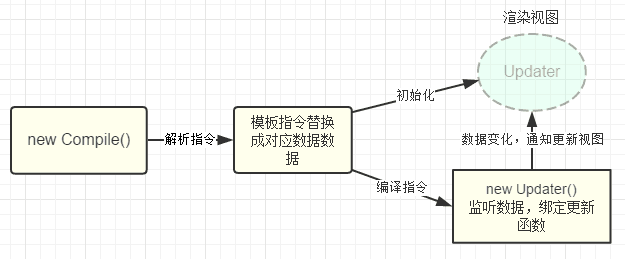

# vue组件通信
* 父-->子组件通信

props属性来实现:父组件通过向子组件添加标签添加自定义属性，子组件通过props属性来获取该值；

* 子-->父组件通信

事件触发：通过emit方法主动来通知父组件改变数据，从而达到子组件改变数据的目的。

* 兄弟组件通信

通过eventHub实现：相当于创建一个时间中心（中转站），可以用它来传递和接收事件，比如
中转站： const hub = new Vue();
触发： hub.$emit('change', 'hehe')
接收： hub.$on('change', callback)

# vue双向绑定原理
vue是通过数据劫持结合发布者-订阅者模式来实现双向数据绑定的。


通过一个Observer来实现对数据对象的所有属性进行监听，利用Object.defineProperty()里面的getter和setter对数据进行劫持，然后通知订阅者，订阅者会触发update方法对视图进行更新。



* 实现一个数据监听器Observer，能够对数据对象的所有属性进行监听，如有变动可拿到最新值并通知订阅者

* 实现一个指令解析器Compile，对每个元素节点的指令进行扫描和解析，根据指令模板替换数据，以及绑定相应的更新函数
compile主要做的事情是解析模板指令，将模板中的变量替换成数据，然后初始化渲染页面视图，并将每个指令对应的节点绑定更新函数，添加监听数据的订阅者，一旦数据有变动，收到通知，更新视图

* 实现一个Watcher，作为连接Observer和Compile的桥梁，能够订阅并收到每个属性变动的通知，执行指令绑定的相应回调函数，从而更新视图
Watcher订阅者作为Observer和Compile之间通信的桥梁，主要做的事情是:
  * 在自身实例化时往属性订阅器(dep)里面添加自己
  * 自身必须有一个update()方法
  * 待属性变动dep.notice()通知时，能调用自身的update()方法，并触发Compile中绑定的回调，则功成身退。

* mvvm入口函数，整合以上三者
MVVM作为数据绑定的入口，整合Observer、Compile和Watcher三者，通过Observer来监听自己的model数据变化，通过Compile来解析编译模板指令，最终利用Watcher搭起Observer和Compile之间的通信桥梁，达到数据变化 -> 视图更新；视图交互变化(input) -> 数据model变更的双向绑定效果。

## vue的生命周期钩子
`beforeCreate created beforeMounted mounted beforeUpdate updated beforeDestoryed destoryed`

## 简单描述每个周期具体适合哪些场景
```
答：生命周期钩子的一些使用方法：
beforecreate : 可以在这加个loading事件，在加载实例时触发（事件）
created : 初始化完成时的事件写在这里，如在这结束loading事件，异步请求也适宜在这里调用
mounted : 挂载元素，获取到DOM节点
updated : 如果对数据统一处理，在这里写上相应函数
beforeDestroy : 可以做一个确认停止事件的确认框
nextTick : 更新数据后立即操作dom
```

## 生命周期钩子什么时候触发
```
创建前/后： 在beforeCreate阶段，vue实例的挂载元素el和数据对象data都为undefined，还未初始化。在created阶段，vue实例的数据对象data有了，el还没有。
载入前/后：在beforeMount阶段，vue实例的$el和data都初始化了，但还是挂载之前为虚拟的dom节点，data.message还未替换。在mounted阶段，vue实例挂载完成，data.message成功渲染。
更新前/后：当data变化时，会触发beforeUpdate和updated方法。
销毁前/后：在执行destroy方法后，对data的改变不会再触发周期函数，说明此时vue实例已经解除了事件监听以及和dom的绑定，但是dom结构依然存在
```

## mvvm
model定义数据修改和操作的业务逻辑，view它负责将数据模型转化成UI 展现出来，ViewModel 是一个同步View 和 Model的对象。

## vue的优缺点
* 低耦合 （model viewmodel view）
* 可重用性 多个view可以重用一个viewmodel
* 可测试性
* 独立开发 开发人员和设计人员可以分别开发；

## 路由
`声明式路由（标签跳转）和编程式路由（js跳转）`

## vue nextTick
`vue的数据发生变化会导致视图发生变化，而nextTick中的回调会延迟执行，会延迟到视图发生更新后执行。此时能够获取到最新的dom`

## slot scope
```
插槽 vue中包含单个插槽 具名插槽
是组件中的一块html模板，这个模板显示不显示，以及怎样显示由父级决定。但是插槽显示的位置确由子组件自身决定，slot写在组件template的哪块，父组件传过来的模板将来就显示在哪块。
<template>
    <div class="father">
        <h3>这里是父组件</h3>
        <child>
            <div class="tmpl">
              <span>菜单1</span>
              <span>菜单2</span>
              <span>菜单3</span>
              <span>菜单4</span>
              <span>菜单5</span>
              <span>菜单6</span>
            </div>
        </child>
    </div>
</template>

<template>
    <div class="child">
        <h3>这里是子组件</h3>
        <slot></slot>
    </div>
</template>

具名插槽
<template>
  <div class="father">
    <h3>这里是父组件</h3>
    <child>
      <div class="tmpl" slot="up">
        <span>菜单1</span>
        <span>菜单2</span>
        <span>菜单3</span>
        <span>菜单4</span>
        <span>菜单5</span>
        <span>菜单6</span>
      </div>
      <div class="tmpl" slot="down">
        <span>菜单-1</span>
        <span>菜单-2</span>
        <span>菜单-3</span>
        <span>菜单-4</span>
        <span>菜单-5</span>
        <span>菜单-6</span>
      </div>
      <div class="tmpl">
        <span>菜单->1</span>
        <span>菜单->2</span>
        <span>菜单->3</span>
        <span>菜单->4</span>
        <span>菜单->5</span>
        <span>菜单->6</span>
      </div>
    </child>
  </div>
</template>


<template>
  <div class="child">
    // 具名插槽
    <slot name="up"></slot>
    <h3>这里是子组件</h3>
    // 具名插槽
    <slot name="down"></slot>
    // 匿名插槽
    <slot></slot>
  </div>
</template>

作用域插槽
<slot name="up" :data="data"></slot>
 export default {
    data: function(){
      return {
        data: ['zhangsan','lisi','wanwu','zhaoliu','tianqi','xiaoba']
      }
    },
}
```

## method computed watch
```
method需要手动去调用，computed watch会在数据发生变化时去自动调用这个函数。
computed是计算属性，和data里的数据属性是同一类（使用上）
watch是监听机制加事件机制
watch: {
  firstName: function (val) { this.fullName = val + this.lastName }
}
watch擅长处理的场景：一个数据影响多个数据，watch 选项，来响应数据的变化。当你想要在数据变化响应时，执行异步操作或开销较大的操作，这是很有用的。
computed擅长处理的场景：一个数据受多个数据影响
1.methods里面的函数就是一群“耿直Boy”，如果有其他父函数调用它，它会每一次都“乖乖”地执行并返回结果，即使这些结果很可能是相同的，是不需要的
2.而computed是一个“心机Boy”，它会以Vue提供的依赖追踪系统为基础，只要依赖数据没有发生变化,computed就不会再度进行计算
https://www.jb51.net/article/120073.htm
```

## virtual dom
 * 用js对象模拟dom树
 * 当状态发生变更的时候，再创建一个虚拟dom树，然后比较两颗虚拟dom树之间的差异
 * 把差异应用到真实的dom树上
 
 本质是在dom和js之间做了一个缓存。

## vue router实现原理
